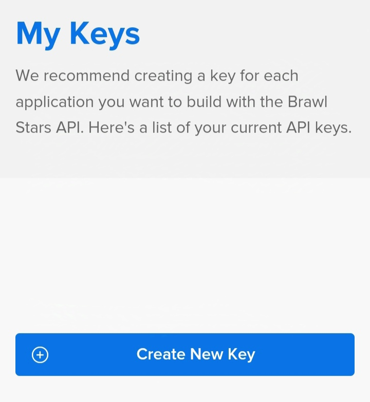
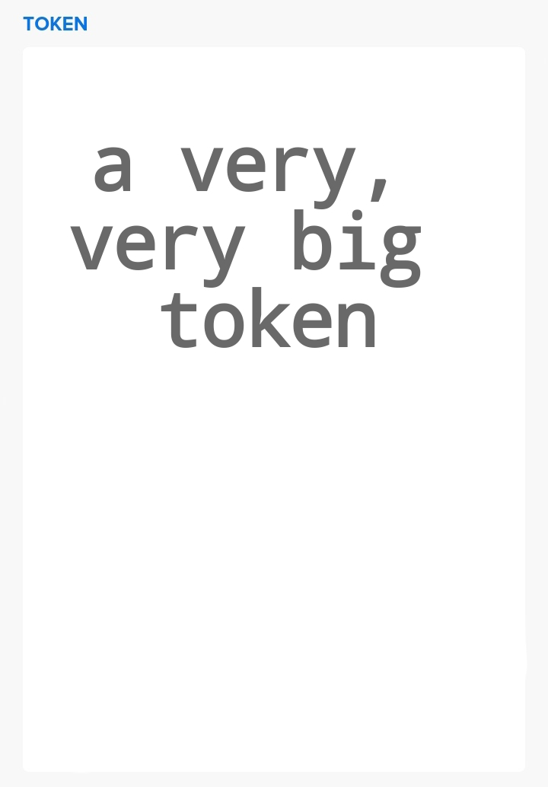
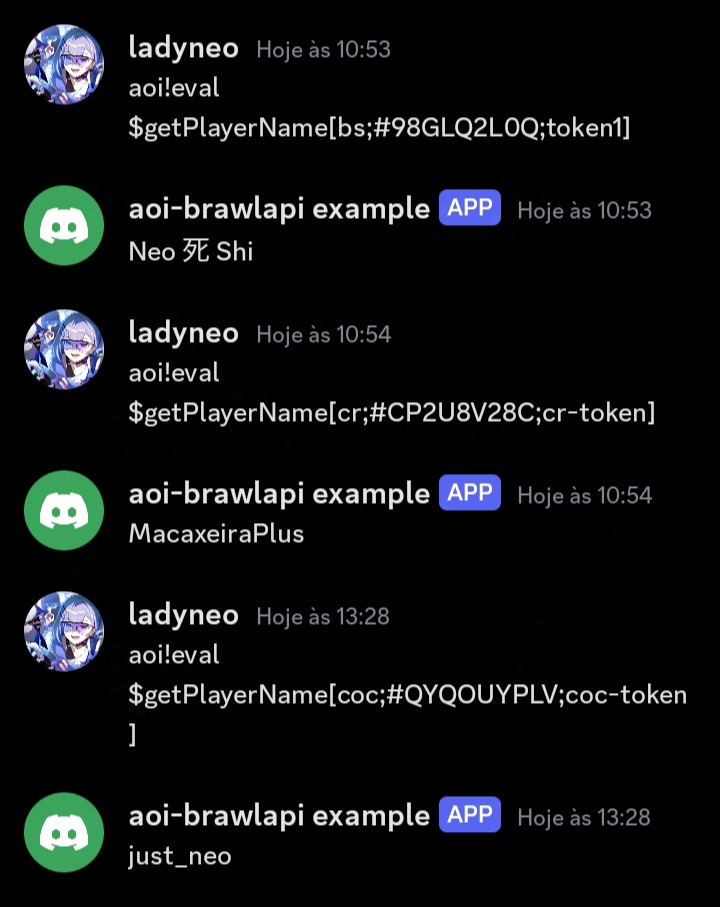

# aoi-supercell
This repository contains a template for creating bots using the Aoi.js library with integration to the Brawl Stars API. The goal of this template is to provide a solid and easy-to-use foundation for developers looking to build custom bots that interact with Brawl Stars data, such as player statistics and match information.

## Setup
If you'd like to create a new project based on this one, follow these steps:
```bash
git clone https://github.com/ladyneo/aoi-brawlapi.git
cd aoi-brawlapi
npm install
```
This will clone the repository, creating a new directory, and installing the aoi.js dependency.

## Registering a Token
First you need to create an account on the [Supercell API](https://developer.brawlstars.com/#/key/74b57cfc-961f-486b-b3d7-52d1fde4528d).
Then you need to access the "My Account" tab.
<div align= "center">
 
</div>

Now you must create a new key:
<div align="center">
 
</div>

Now copy the token.
<div>
 
</div>

After that use the following function:
```php
$registerToken[here-goes-the-name-of-the-token;here-goes-the-token-you-copied]
```

## Functions
Parameters with ? at the end of the name are optional parameters.
- `$registerToken[token-name;token]`
- `$unregisterToken[token-name]`
- `$getTokens[sep?]`
- `$getTokenValue[token-name]`
- `$getPlayerName[game (coc/cr/bs);#PlayerID;token-name]`

<div>
 
</div>

- `$getPlayerTrophies[#PlayerID;token-name]`
- `$getPlayerClubName[#PlayerID;token-name]`
- `$getPlayerClubTrophies[#PlayerID;token-name]`
- `$getPlayerClubID[#PlayerID;token-name]`
